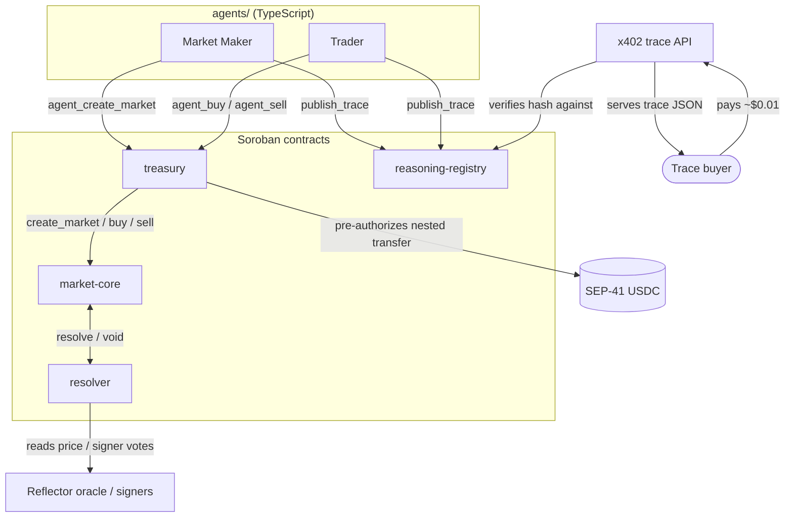

# OracleDesk (Stellar)

**Status: testnet only · unaudited · pre-alpha**

OracleDesk is an autonomous prediction-market system: a Market Maker agent
seeds markets from signals it observes, a Trader agent trades mispricings
against a fair-value estimate, and every decision either agent makes is
hashed and recorded on-chain before it acts — so a subscriber can pay about
$0.01 (via [x402](https://x402.org)) to read the exact reasoning behind a
trade and check it against the on-chain hash, rather than trusting the
agent's word for it.

This is the Stellar/Soroban native port of the system originally built for
the Agora Hackathon on Arc + Polygon (Solidity, Polymarket execution, Circle
CCTP/Wallets). None of that Arc-era execution stack is part of this repo —
markets, trading, resolution, the reasoning registry, and the agent treasury
are all native Soroban contracts, collateralized in a SEP-41 USDC token.
Polymarket survives only as an optional, execution-free reference price an
agent's strategy may read (see `agents/core/strategy.ts`).

## Architecture



Design decisions with real trade-offs are written up in `docs/adr/`:

- [0001: resolution commitment](docs/adr/0001-resolution-commitment.md) — why
  a market commits to its resolution rule at creation, before trading opens.
- [0002: cross-contract calls](docs/adr/0002-cross-contract-calls.md) — why
  `resolver`/`treasury` generate a client from `market-core`'s compiled wasm
  instead of a normal Cargo dependency (the latter breaks the wasm build).

## Prerequisites

- Rust (stable) with the `wasm32v1-none` target — `rust-toolchain.toml`
  pins this for you if you use `rustup`.
- The [Stellar CLI](https://developers.stellar.org/docs/tools/cli) (`stellar`), v27+.
- Node.js 20+ and npm.
- Python 3.10+ (for `model/fpmm_model.py`'s property tests).
- `jq` (used by the deploy/seed scripts).

## Quickstart

```bash
make setup          # npm install in x402/, agents/, packages/bindings/*
make build           # cargo build + stellar contract build for all 4 contracts
make test            # cargo test, model/fpmm_model.py, x402 tests
make lint            # cargo fmt --check + clippy -D warnings
make deploy-testnet   # idempotent: generates/funds testnet identities,
                      # deploys all 4 contracts + a self-issued test USDC,
                      # wires them together, writes deployments/testnet.json
make demo            # create -> trade -> resolve -> record trace -> verify hash,
                      # entirely on testnet, with real transaction output
```

`make deploy-testnet` and `make demo` submit real Stellar testnet
transactions using two throwaway identities (`oracledesk-deployer`,
`oracledesk-agent`) that `scripts/deploy-testnet.sh` generates and funds via
`stellar keys generate --fund`. Nothing here ever touches mainnet.

## Repository layout

```
contracts/            market-core, resolver, treasury, reasoning-registry
model/fpmm_model.py   Python mirror of the FPMM math, property-tested
x402/                 the paid trace API (Express + @x402/*)
agents/               core/ (chain-agnostic strategy + trace building),
                      stellar/ (signing/submission adapter), bin/ (CLIs)
packages/bindings/    generated TypeScript contract clients
scripts/              deploy-testnet.sh, seed-market.sh, demo.sh,
                      gen-bindings.sh, spec-hash/ (a small dev-tool crate)
deployments/          testnet.json — the current live testnet addresses
docs/                 architecture, ADRs, frontend-integration, STATUS
```

## Contributing

See [CONTRIBUTING.md](CONTRIBUTING.md) for dev setup, branch/commit
conventions, and how issues are scoped. Issues seeded for the
[Drips Stellar Wave Program](https://drips.network) live as files in
`docs/wave-issues/` before they're filed.

## Status

`docs/STATUS.md` is the honest, current account of what's verified, what's
unverified, and what's left — read it before assuming any given piece works
end to end.

## License

[MIT](LICENSE)
